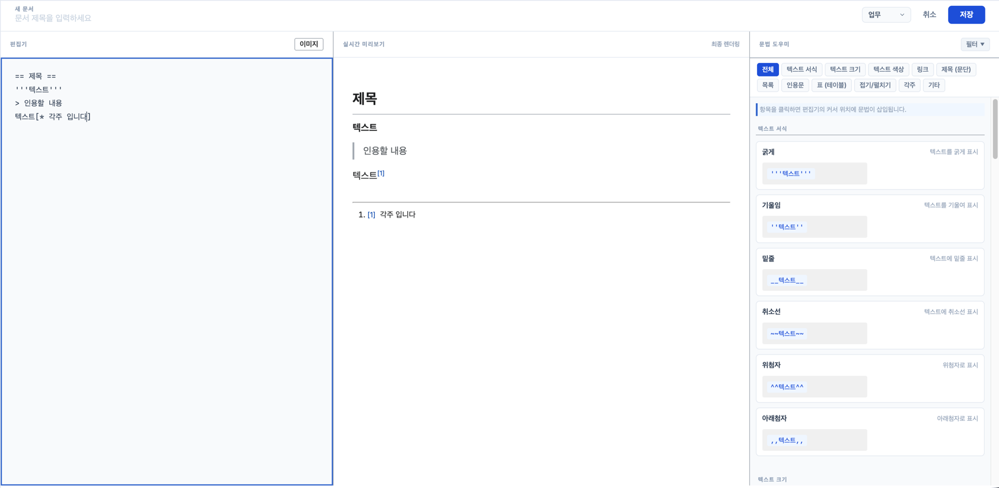
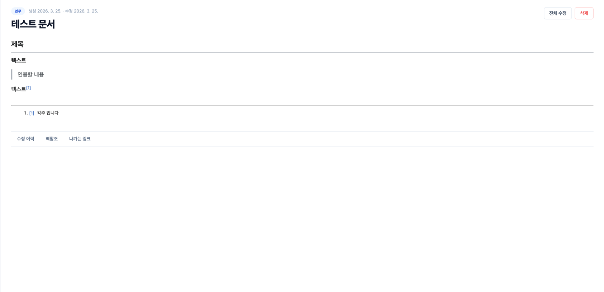
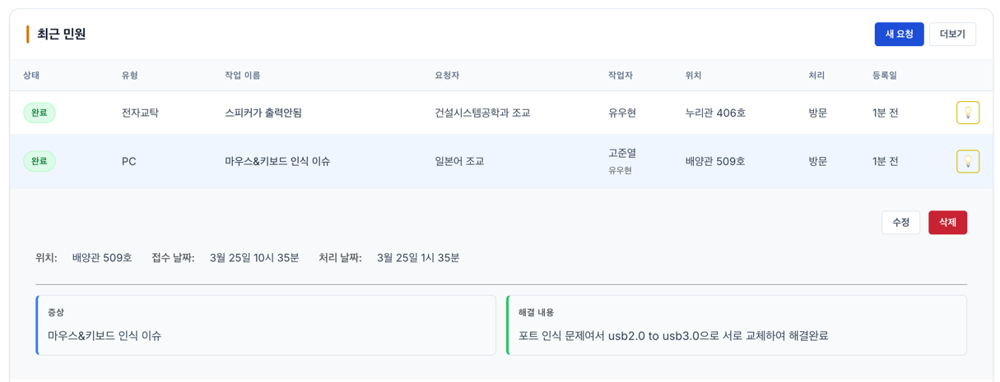
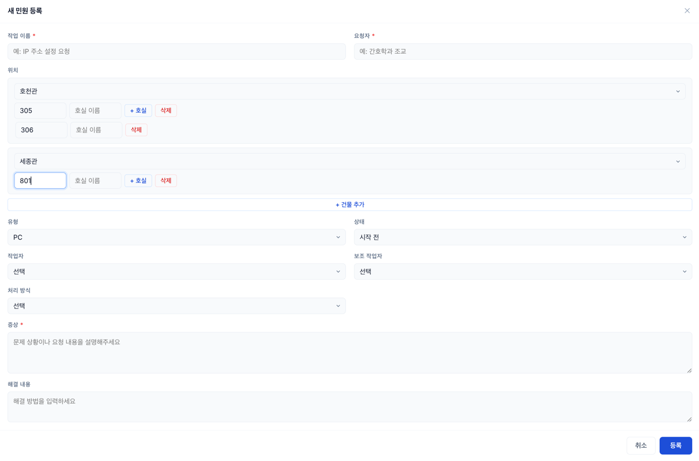
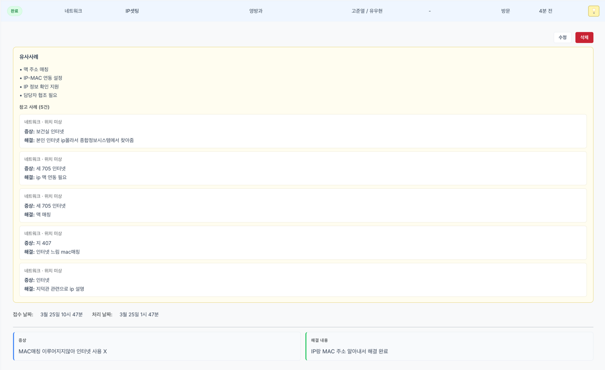
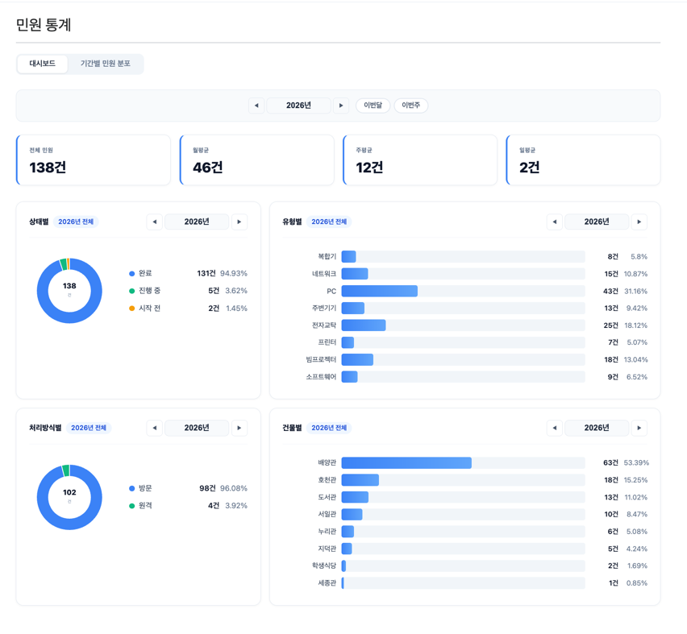
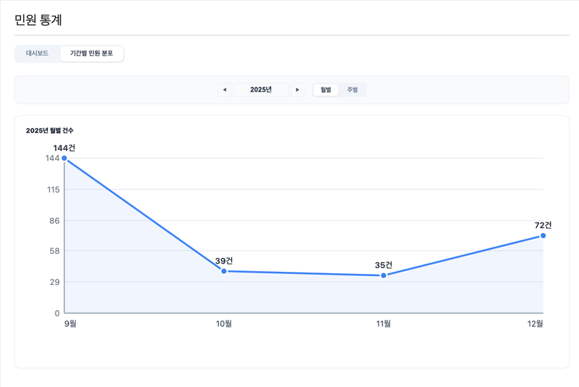
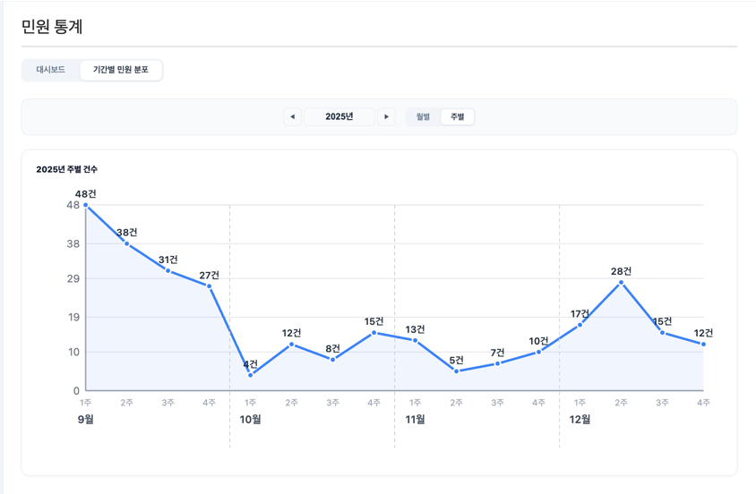
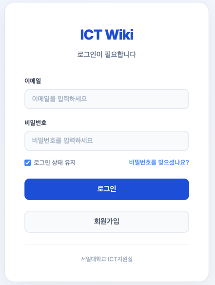

# 🏫 ICT Wiki — ICT팀 사내 지식 관리 & 민원 처리 시스템

> ICT 팀의 기술 지식을 체계적으로 축적하고, 현장 민원을 효율적으로 처리하기 위해 개발한 사내 전용 백엔드 서버입니다.  
> 프론트엔드 리포지토리: [ictwikifront](https://github.com/dlgkrals/ictwikifront)

---

## 📌 프로젝트 배경 및 목적

ICT 팀 내에서 반복되는 장비 트러블슈팅 노하우가 구성원 개인에게만 쌓이고 조직 차원에서 공유되지 않는 문제가 있었습니다.  
또한 교직원·학생 민원이 구두나 메신저로만 접수되어 처리 상태 추적이 어렵다는 한계도 있었습니다.

이를 해결하기 위해 다음 두 가지를 핵심 목표로 개발했습니다.

1. **집단 지성 기반 위키** — 누구나 문서를 작성·수정하고, 문서 간 링크로 지식을 연결
2. **민원 처리 워크플로우** — 접수부터 완료까지 상태를 투명하게 추적

---

## 🛠️ 주요 기능

### 1. 위키 문서 관리
- 마크다운 형식의 문서 작성 및 수정
- 나무마크에서 착안한 위키 링크 문법 지원 (`[[문서제목]]` / `[[표시텍스트|문서제목]]`)
- 편집기·실시간 미리보기·문법 도우미 3단 구성 — 문법을 몰라도 항목 클릭만으로 커서 위치에 자동 삽입
- 문서 간 링크 관계 추적 및 역참조(backlink) 조회
- 수정 이력(버전) 관리
- 소프트 삭제 지원

### 2. 민원(Inquiry) 관리
- 8가지 장비 유형별 분류: PC, 네트워크, 소프트웨어, 복합기, 프린터, 전자교탁, 빔프로젝터, 주변기기
- 처리 상태 관리: `시작 전` → `진행 중` → `완료` / `보류` / `야간`
- 작업자 배정, 처리 방식(원격/방문), 작업 날짜 기록
- 상태·유형·작업자·처리방식 기준 필터링
- 아코디언 방식 상세보기 — 페이지 이동 없이 목록에서 행 클릭만으로 상세 내용 확인

### 3. RAG 기반 유사사례 검색
- 민원 완료 처리 시 내용을 임베딩하여 벡터 DB에 자동 저장
- 신규 민원 접수 시 벡터 유사도 검색으로 가장 유사한 과거 사례 5건 추출
- LLM 기반 유사사례 요약 제공으로 빠른 해결 방향 파악 가능
- 💡 버튼 하나로 즉시 실행 — 별도의 준비나 설정 없이 클릭 한 번으로 유사사례 분석 완료

### 4. 민원 통계
- 유형별, 처리방식별, 건물별, 상태별 통계 제공
- 월별·주별 추이 확인 가능
- 전체 민원 수, 일평균·주평균·월평균 등 종합 현황을 한눈에 파악할 수 있는 대시보드

### 5. 공지사항
- 제목, 목록 등 공지 작성에 유용한 기본 문법 제공
- 최신 공지 우선 정렬

### 6. 인증
- 세션 기반 로그인 (BCrypt 암호화)
- 최초 로그인 시 이메일 인증 링크 발송 — 별도 코드 입력 없이 링크 클릭만으로 인증 완료
- 로그인 상태 유지(Remember-Me) — 재접속 시 로그인 과정 없이 바로 이용 가능
- 로그인 5회 실패 시 5분, 10회 이상 실패 시 30분 계정 잠금
- 이메일 기반 비밀번호 재설정 지원

---

## 💻 기술 스택

| Category | Technologies                                                                                                                                                                                                                                                                                                                                                                |
|----------|-----------------------------------------------------------------------------------------------------------------------------------------------------------------------------------------------------------------------------------------------------------------------------------------------------------------------------------------------------------------------------|
| Backend |    |
| Database |                                                                                                                                                              |
| Cloud |                                                                                                                                           |
| DevOps |                                                                                                                                                                                                                                          |
| Frontend |                                  |
---

## 🔍 설계 포인트

### 이벤트 기반 문서 처리
문서 저장 시 위키 링크 파싱·저장과 수정 이력 생성을 `ApplicationEvent`로 분리했습니다.  
비즈니스 로직(저장)과 부가 기능(링크 처리, 이력)의 결합도를 낮추고, 이후 기능 추가가 용이하도록 설계했습니다.

### 유연한 편집 권한 설계
민원은 담당자 인수인계 상황을 고려해, 위키는 집단 지성 협업을 고려해 작성자 외 구성원도 수정 가능하도록 의도적으로 설계했습니다.  
대신 모든 변경 사항은 수정 이력으로 추적됩니다.

### 소프트 삭제
데이터 복구 가능성 및 이력 보존을 위해 `deleted` 플래그를 통한 논리 삭제를 적용했습니다.
